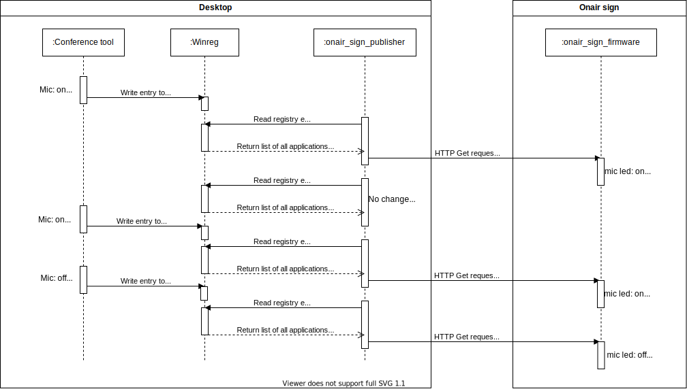

# Onair sign

Onair sign to indicate whether you're in a conference call. The onair sign is able to show whether
your webcam is turned on. The setup consists of two components:

## Onair sign

The physical onair sign that is based on an ESP32 that acts as http server that waits for a http get
request to receive the current state of the microphone and the webcam.

The current version is only a POC based on a breadboard setup. A nicer version with a real case is on the way.

Check [here](/onair_sign_firmware) for further details on the ESP32 firmware and 
[here](/hardware) for the hardware. 

## Onair sign publisher

The publisher is a desktop application that checks the computers microphone/webcam state and publishes it
via http to the actual onair sign.

The current version **only supports Windows** since it uses some registry entries to determine if an
application is accessing the microphone/webcam. Anyway, adding support for Linux shouldn't be to hard.

The following diagram shows the functionality:

